# 🏛️ Arquitectura de Seguridad y Despliegue

Este documento describe la topología y el flujo de la información del sistema "Policy-as-Code" implementado en el clúster de Kubernetes, basado en OPA Gatekeeper y el dashboard GPM.

## 1. Topología de Componentes

La arquitectura se compone de cuatro grandes bloques operativos:

1. **Git Repository (Single Source of Truth):**
   * Contiene la Infraestructura como Código (IaC).
   * Directorio `manifests/`: Almacena la configuración global (`gatekeeper-config.yaml`), las clases de políticas (`ConstraintTemplates`), las reglas instanciadas (`Constraints`) y el dashboard (`gpm.yaml`).

2. **Kube-API Server (Control Plane):**
   * Es la puerta de entrada al clúster. Recibe todas las peticiones de creación, modificación o eliminación de recursos.
   * Delega la validación de seguridad a Gatekeeper mediante una configuración de `ValidatingWebhookConfiguration`.

3. **OPA Gatekeeper (Motor de Políticas):**
   * **Controller Manager:** Desplegado vía Helm en el namespace `gatekeeper-system`. Mantiene en caché las políticas escritas en lenguaje Rego y evalúa las peticiones en tiempo real (microsegundos) cuando el Kube-API se lo solicita.
   * **Audit Pod:** Escanea el clúster en un ciclo continuo (cada 60 segundos, definido en `auditInterval`) para detectar recursos preexistentes que violan las reglas activas. Inyecta los resultados en el campo `status` de cada Constraint.

4. **Gatekeeper Policy Manager (Capa de Visualización):**
   * Interfaz web *stateless* desplegada en el puerto `30080` (NodePort).
   * Posee un rol estricto de RBAC (`get`, `list`, `watch`) que le impide modificar el clúster. Su única función es consultar a la API de Kubernetes para renderizar gráficamente las violaciones detectadas por el Audit Pod.

## 2. Diagrama de Flujo (Validating Admission Webhook)

El siguiente diagrama ilustra cómo Gatekeeper intercepta y procesa una petición antes de que llegue a la base de datos de Kubernetes (`etcd`).

```mermaid
sequenceDiagram
    participant User as Usuario / Pipeline
    participant API as Kube-API Server
    participant RBAC as Autenticación / RBAC
    participant Webhook as OPA Gatekeeper Webhook
    participant ETCD as etcd (Base de Datos)

    User->>API: kubectl apply -f pod.yaml
    API->>RBAC: ¿Quién es y tiene permisos?
    RBAC-->>API: Permiso concedido
    API->>Webhook: Intercepta petición (ValidatingWebhook)
    
    rect rgb(50, 50, 50)
        Note over Webhook: Evaluación de Políticas (Rego)
        Webhook->>Webhook: Verifica exclusiones (ej. kube-system)
        Webhook->>Webhook: Compara contra Constraints
    end

    alt Viola política (Enforce / Deny)
        Webhook-->>API: Denegado
        API-->>User: Error: Admission Webhook denied the request
    else Cumple política o está en Dryrun
        Webhook-->>API: Admitido
        API->>ETCD: Persiste el recurso en la DB
        ETCD-->>API: Confirmación de guardado
        API-->>User: pod/creado exitosamente
    end
```

## 3. Decisiones de Diseño y Seguridad (Security by Design)

Para asegurar la propia infraestructura de Gatekeeper, se aplicaron los siguientes controles arquitectónicos:

* **Exclusiones Críticas:** Se configuró un CRD de exclusión (`gatekeeper-config.yaml`) para evadir el escaneo en namespaces del plano de control (`kube-system`). Si una regla mal configurada bloquea un componente de red (como Calico) en el namespace del sistema, el clúster entero caería.
* **Hardening del Dashboard:** El contenedor de GPM opera sin privilegios de root (`runAsNonRoot: true`), no tiene capacidades de escalamiento (`allowPrivilegeEscalation: false`) y su sistema de archivos raíz es de solo lectura, escribiendo su caché únicamente en un volumen temporal volátil (`emptyDir` montado en `/tmp`).
* **Límites de Consumo:** Se asignaron *Requests* y *Limits* de CPU/RAM al dashboard para prevenir la denegación de servicio por agotamiento de recursos (Resource Exhaustion) en el nodo maestro.
